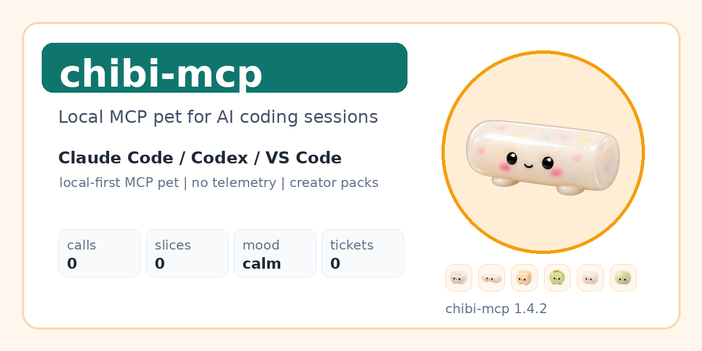
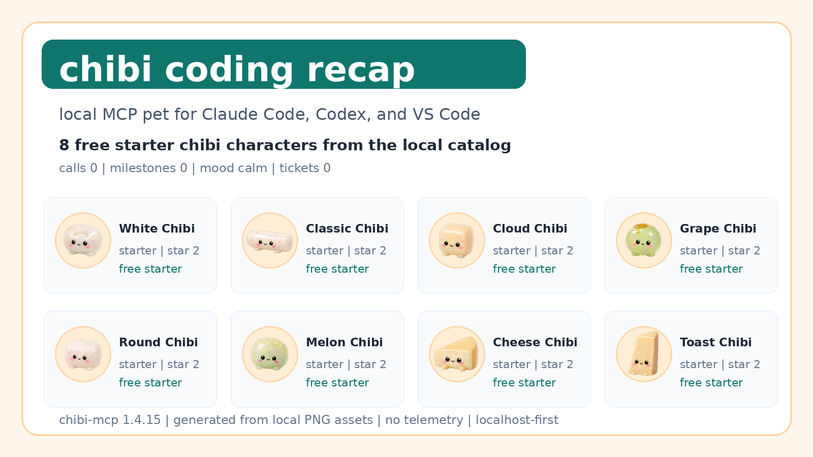
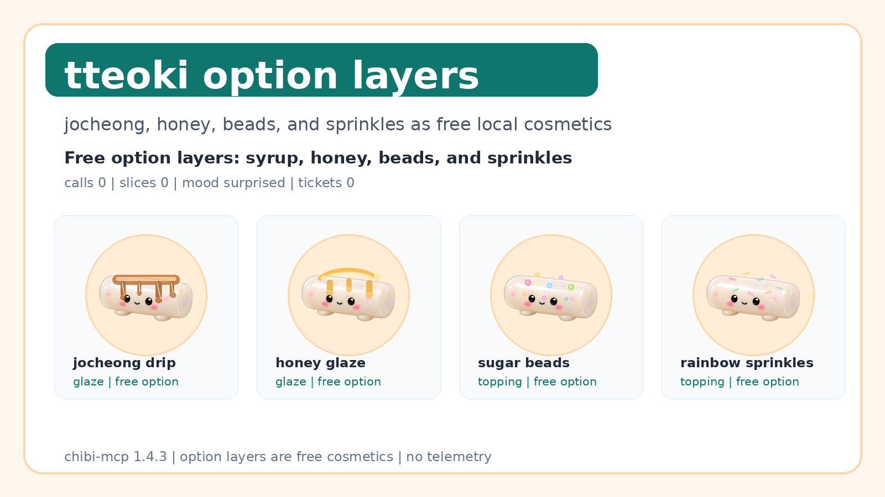

# chibi-mcp

[](https://github.com/soccz/chibi-mcp/actions/workflows/build.yml)
[](LICENSE)
[](SECURITY.md)

> 치비 (chibi) — Korean rice cake MCP pet for Claude Code, Codex, and VS Code.
>
> Gacha-collect squishy characters (떡·과일·치즈·만두). They react to your coding session and get sliced every N tool calls.
>
> **MIT, no telemetry, OS-agnostic** — installed from GitHub, powered by a local MCP server.

Star this repo to follow monthly character drops, VS Code builds, creator packs, and the no-telemetry MCP pet roadmap.

<p align="center">
  
</p>

<p align="center">
  
</p>

<p align="center">
  
</p>

## Install from GitHub

One-command installers:

```bash
# Claude Code
bash <(curl -fsSL https://raw.githubusercontent.com/soccz/chibi-mcp/main/scripts/install-claude.sh)

# Codex
bash <(curl -fsSL https://raw.githubusercontent.com/soccz/chibi-mcp/main/scripts/install-codex.sh)
```

Manual install:

```bash
pipx install "git+https://github.com/soccz/chibi-mcp.git#subdirectory=server"
```

Then connect it to your client:

```bash
# Codex CLI
codex mcp add chibi -- chibi-mcp

# Claude Code CLI
claude mcp add chibi -- chibi-mcp
```

Claude Code plugin install:

```text
/plugin marketplace add soccz/chibi-mcp
/plugin install chibi@chibi-mcp
```

Codex plugin marketplace:

```bash
codex plugin marketplace add soccz/chibi-mcp
```

VS Code users can download the `.vsix` from the latest GitHub Release and install it:

```bash
code --install-extension chibi-mcp-*.vsix
```

See [INSTALL.md](INSTALL.md) for the full GitHub install matrix.

Health check (either form works):

```bash
chibi-mcp --check     # or:  chibi-check
```

Commercial-readiness helpers:

```bash
chibi-audit                         # local trust report: no telemetry, localhost, assets, hooks
chibi-pack init ./my-pack            # scaffold a creator/team character pack
chibi-pack validate ./my-pack        # validate a creator/team character pack
chibi-pack preview ./my-pack         # write ./my-pack/preview.html
chibi-pack validate examples/packs/spring-hwajeon  # from a clone
chibi-pack validate examples/packs/team-sprint     # from a clone
chibi-share --out share-card.png     # generate a 1080x1080 session share card
chibi-share --preset social-preview --out social-preview.png
chibi-share --preset lineup --out starter-lineup.png
chibi-share --preset options --out option-showcase.png
```

Now ask your client:

> `/chibi`
> "내 치비 보여줘"
> "뽑기 한 번"
> "보관함 열어"
> "조청 드립 옵션 적용해줘"

## What you get

- 🍡 **8 starter characters** released now (white_tteok, garaetteok_short, baekseolgi, mochi, green_grape, melon, cheddar, toast — all ★★)
- 🍯 **12 free option layers** released now across syrup, glaze, powder, seeds, petals, resin stars, and sauce.
- 🔒 **21 more characters coming later** including the ★★★★★ rainbow series, all 떡 varieties, cheeses, fruits, mandu. Catalog shows them as "???" placeholders until release.
- 🎟 **Gacha pulls** — weighted by rarity (1% / 5% / 24% / 70%)
- 📦 **Collection** — see what you've got, switch active character, rename them
- ⏱ **Slice cycle** — every N Claude tool calls (default 10), your pet gets sliced
- 🎭 **Mood** driven by CPU·RAM·battery·idle (panting / drowsy / lonely / happy / surprised / joyful / calm)

The remaining 21 characters are catalog placeholders for future drops; release timing is TBD.

## Why Developers Star It

- **Immediate dopamine** — one-command install, then a visible pet reacts to your coding session.
- **Local-first trust** — no telemetry, localhost-only runtime, explicit `chibi-mcp --check`.
- **AI-native surface** — Claude Code plugin, Codex plugin metadata, MCP server, and VS Code `.vsix` from one repo.
- **Share loop** — "today's slices", starter lineups, character pulls, and local share cards are built for screenshots.
- **Open content loop** — character packs and creator submissions are planned around transparent metadata, not a closed store.

## Product Strategy

chibi-mcp is positioned as an **AI coding companion identity layer**: a local MCP pet that can grow into character drops, creator packs, team distribution, brand collaborations, and desk-culture goods without reducing the free core.

The base product stays free: Pet / Notification / Widget / VTuber modes, MCP tools, system status, starter characters, option layers, and local state are not commercial gates. Monetization is not enabled: no paid packs, no paid random pulls, no Sponsors tiers, no license keys, and no team pricing unless explicitly approved later.

See [COMMERCIAL_STRATEGY.md](COMMERCIAL_STRATEGY.md) for the commercial expansion plan, [GITHUB_STAR_STRATEGY.md](GITHUB_STAR_STRATEGY.md) for the source-backed GitHub growth plan, [docs/CREATOR_PACKS.md](docs/CREATOR_PACKS.md) for creator/team pack submissions, and [docs/LAUNCH_KIT.md](docs/LAUNCH_KIT.md) for launch/distribution copy.

The first commercial-product surfaces are already executable:

- `chibi-audit` gives users and teams a local trust report before they install hooks widely.
- `chibi-pack` validates and previews creator/team character packs before any marketplace exists.
- `examples/packs/spring-hwajeon` and `examples/packs/team-sprint` are runnable pack templates for creators and teams.
- `chibi-share` creates a local share card so the repo can grow through screenshots without telemetry.

## MCP tools

| Tool | Description |
|---|---|
| `get_pet_state` | mood + system metrics + counters + active character |
| `pet_say(text)` | Speech bubble (text sanitized to 200 chars) |
| `slice_now` | Force a slice event |
| `set_slice_interval(n)` | Change slice cadence (default 10) |
| `pull_gacha` | Pull one character (1 free/day, else 1 ticket) |
| `get_inventory` | Owned characters + ticket balance |
| `set_active_character(id)` | Switch the active 치비 |
| `get_options` | Free visual option layers such as 조청, honey, kinako, sesame, petals, resin stars |
| `set_active_options([ids])` / `clear_active_options` | Apply up to 3 free option layers |
| `rename_character(id, nickname)` | Rename a 치비 you own |
| `open_pet_window` / `close_pet_window` | Spawn or close the floating tk window |
| `get_catalog` / `get_license_status` | Catalog (license-filtered) + tier status |
| `add_ticket(n)` | Manual ticket grant (debug / promo) |

## Anywhere bridge — `chibi-say`

The Python package ships a tiny CLI alongside the MCP server:

```bash
chibi-say "굳!"
chibi-say "build broke 🥺"
```

It opens a one-shot WebSocket connection to the running chibi server (`ws://127.0.0.1:9876` by default) and publishes a speech bubble that pops up below your floating 치비. Silent no-op when nothing is running, so it's safe to drop into any script.

**Pre-wired in:**

- **Claude Code** — `hooks/hooks.json` fires `bin/chibi-react.sh` on `PreToolUse` / `PostToolUse` for `Write|Edit|Bash|Read`; the script picks a contextual phrase and calls `chibi-say`. Throttled to ~30% so you don't get a bubble on every keystroke.
- **VS Code extension** — calls `chibi-say` on file save, task start/end, and debug start/stop (throttled). Disable via the `chibiMcp.sayBridge.enabled` setting.

**Roll your own** — any tool that runs a shell command can talk to your 치비:

```bash
# Git post-commit hook (.git/hooks/post-commit)
#!/usr/bin/env bash
chibi-say "🎉 commit!"

# Makefile target
build:
	npm run build && chibi-say "build 굳!" || chibi-say "build 시무룩"

# CI script reaction
./run_tests.sh && chibi-say "초록 ✨" || chibi-say "빨강 🥺"

# Shell prompt finisher (zsh — runs after every command)
precmd() { [ $? -ne 0 ] && chibi-say "음..."; }
```

Codex CLI users: `chibi-say` works the same as anywhere else, but Codex doesn't yet have a documented hook system to auto-wire — invoke it from your scripts or use the same git/Makefile patterns above.

## Layout (for contributors)

```
chibi-mcp/
├── .codex-plugin/plugin.json   # Codex plugin manifest
├── .claude-plugin/plugin.json   # plugin manifest
├── .mcp.json                    # stdio MCP server spec
├── skills/chibi/SKILL.md        # behaviour guide for Claude
├── commands/chibi.md            # /chibi slash command
├── COMMERCIAL_STRATEGY.md       # expansion readiness, deferred monetization guardrails
├── GITHUB_STAR_STRATEGY.md      # README, topics, community, launch loop
├── scripts/                     # install + verification scripts
├── assets/                      # starter PNG assets, option layers + catalog meta.json
├── server/                      # Python MCP server package
└── server-rs/                   # (optional) Rust rewrite, same protocol
```

## Client Paths

The plugin/MCP path is the primary install path for Claude Code and Codex. Other clients stay available as user-facing surfaces:

- **Floating pet window** — spawned by the Python MCP server via `open_pet_window` (frameless, always-on-top, mood-tinted, sound-reactive). Pure tkinter + Pillow; uses PyObjC for true transparency on macOS. No separate install — comes with `pipx install chibi-mcp`.
- **VS Code extension** (`vscode-ext/`) — optional sidebar experience that also fires `chibi-say` bubbles into the floating window on save / task / debug events. Tagged GitHub Releases package it as a downloadable `.vsix`.
- **Tauri desktop app** (`desktop/`) — legacy; kept archived for v0.1-v0.2 reference. Not part of the current install path.

## Community

- Character ideas and creator packs: use the character pack issue form.
- Install problems: include `chibi-mcp --check` output.
- Screenshots/share cards: use the showcase issue form.
- Contributions: see [CONTRIBUTING.md](CONTRIBUTING.md).
- Security reports: see [SECURITY.md](SECURITY.md).

## Not affiliated with Anthropic

chibi-mcp is an independent open-source project. The `claude` CLI and the MCP protocol it implements are tools by Anthropic; this project is not endorsed by them.

## License

MIT.
